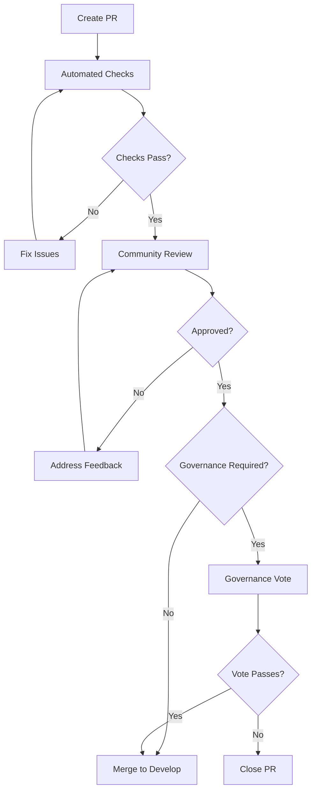

# Contributing Guide

Welcome to AI-Interlinq! This guide outlines how to contribute to the project while maintaining LAW-001 compliance and following our governance procedures.

## Table of Contents

1. [Overview](#overview)
2. [LAW-001 Compliance Requirements](#law-001-compliance-requirements)
3. [Getting Started](#getting-started)
4. [Development Workflow](#development-workflow)
5. [Code Standards](#code-standards)
6. [Testing Requirements](#testing-requirements)
7. [Documentation Standards](#documentation-standards)
8. [Governance Participation](#governance-participation)
9. [Review Process](#review-process)
10. [Release Process](#release-process)

## Overview

AI-Interlinq is a dual-purpose system combining high-performance AI communication with the law.ai governance framework. All contributions must respect both aspects:

- **Communication Layer**: High-performance, well-tested, secure
- **law.ai System**: LAW-001 compliant, immutable laws, governance-controlled

### Core Principles

1. **LAW-001 Compliance**: All code must be compatible with the learning cycle framework
2. **Immutable Laws**: Core governance rules cannot be modified without proper approval
3. **Test-Driven Development**: All features must have comprehensive tests
4. **Documentation First**: All changes require documentation updates
5. **Performance Awareness**: Maintain sub-10ms message latency targets
6. **Security First**: All communications must be encrypted and authenticated

## LAW-001 Compliance Requirements

### Mandatory Requirements for Contributors

Every contributor must understand and comply with LAW-001:

- **ID:** LAW-001
- **Title:** Cause-Input-Action-Law-Reaction-Output-Effect Learning Cycle
- **Status:** CRITICAL - ENFORCEABLE - IMMUTABLE
- **Version:** 1.1.0

#### What This Means for Contributors

1. **All AI operations must trigger the 6-step learning cycle**
2. **Snapshots must be generated for every execution**
3. **Pattern deviations must be detected and reported**
4. **Core law logic cannot be modified without governance approval**

#### Compliance Verification

Before contributing, verify your development environment is LAW-001 compliant:

```bash
# Verify compliance
python -c "
from ai_interlinq.core.learning_cycle import LearningCycle
from ai_interlinq.core.status_checker import StatusChecker

cycle = LearningCycle()
status_checker = StatusChecker()

compliance = cycle.verify_compliance()
print(f'LAW-001 Compliance: {compliance.get(\"status\", \"UNKNOWN\")}')

deps = status_checker.check_dependencies()
for dep, status in deps.items():
    print(f'{dep}: {\"✅\" if status else \"❌\"}')
"
```

### Restricted Areas

The following components are **governance-controlled** and require special approval:

- `law.ai` - Core law definition file
- `governance/law_control.governance` - Governance control system
- Core learning cycle logic in `core/learning_cycle.py`
- Snapshot validation in `core/snapshot_manager.py`
- Pattern detection thresholds in `core/pattern_detector.py`

#### Making Changes to Restricted Areas

1. **Create a Governance Proposal**:
   ```python
   from ai_interlinq.governance.voting_system import VotingSystem
   
   voting_system = VotingSystem()
   
   proposal = {
       "title": "Modify pattern detection threshold",
       "description": "Increase deviation threshold from 0.1 to 0.15",
       "law_id": "LAW-001",
       "proposed_changes": {
           "deviation_threshold": 0.15
       },
       "justification": "Reduce false positive alerts"
   }
   
   proposal_id = voting_system.create_proposal(proposal, "your_contributor_id")
   ```

2. **Wait for Community Vote**
3. **Implement Only After Approval**

## Getting Started

### Prerequisites

- Python 3.8+
- Git
- Understanding of async/await patterns
- Basic knowledge of cryptography concepts
- Familiarity with LAW-001 principles

### Development Environment Setup

1. **Fork and Clone**:
   ```bash
   git clone https://github.com/YOUR_USERNAME/AI-Interlinq.git
   cd AI-Interlinq
   ```

2. **Create Virtual Environment**:
   ```bash
   python -m venv venv
   source venv/bin/activate  # Linux/macOS
   # or
   venv\Scripts\activate     # Windows
   ```

3. **Install Development Dependencies**:
   ```bash
   pip install -e .[dev]
   ```

4. **Verify Installation**:
   ```bash
   python verify_installation.py
   ```

5. **Run Tests**:
   ```bash
   pytest tests/ -v
   ```

### Initial Compliance Setup

Set up law.ai compliance for development:

```bash
# Create required directories
mkdir -p memory/snapshots
mkdir -p governance

# Initialize law.ai system
python setup_law_ai.py

# Verify compliance
python law001_verification.py
```

## Development Workflow

### Branch Strategy

We use a governance-aware Git flow:

```
main (protected, governance-controlled)
├── develop (integration branch)
├── feature/communication-enhancement
├── feature/law-ai-improvement
├── governance/law-modification-proposal
└── hotfix/security-patch
```

### Branch Types

- **feature/**: New features or enhancements
- **bugfix/**: Bug fixes that don't affect governance
- **governance/**: Changes requiring governance approval
- **hotfix/**: Critical security or compliance fixes
- **docs/**: Documentation-only changes

### Creating a Feature Branch

```bash
# Start from develop
git checkout develop
git pull origin develop

# Create feature branch
git checkout -b feature/your-feature-name

# Verify compliance before starting
python law001_verification.py
```

### Development Process

1. **Write Tests First** (TDD approach)
2. **Implement Feature** with LAW-001 compliance
3. **Verify Compliance** continuously
4. **Update Documentation**
5. **Submit Pull Request**

#### Example Development Cycle

```python
# 1. Write test first
def test_new_feature_law_compliance():
    """Test that new feature maintains LAW-001 compliance"""
    
    learning_cycle = LearningCycle()
    
    # Test the new feature
    result = await learning_cycle.execute_cycle(
        cause="test_new_feature",
        input_data={"feature": "new_functionality"}
    )
    
    # Verify compliance
    assert result['cycle_completed'] == True
    assert result['compliance_verified'] == True
    assert 'snapshot_id' in result

# 2. Implement feature
async def new_feature(input_data):
    """New feature with built-in LAW-001 compliance"""
    
    # Always trigger learning cycle for AI operations
    learning_cycle = LearningCycle()
    
    result = await learning_cycle.execute_cycle(
        cause="new_feature_execution",
        input_data=input_data
    )
    
    # Process the result
    return process_feature_result(result)

# 3. Verify compliance
def verify_feature_compliance():
    """Verify feature maintains system compliance"""
    
    status_checker = StatusChecker()
    deps = status_checker.check_dependencies()
    
    assert all(deps.values()), f"Dependencies failed: {deps}"
```

## Code Standards

### Python Code Style

We follow PEP 8 with law.ai-specific additions:

```python
# Use type hints
from typing import Dict, List, Optional, Union
import asyncio

async def process_message(
    message: Dict,
    learning_cycle: LearningCycle,
    compliance_required: bool = True
) -> Dict:
    """
    Process message with LAW-001 compliance.
    
    Args:
        message: Message data to process
        learning_cycle: LAW-001 learning cycle instance
        compliance_required: Whether LAW-001 compliance is required
        
    Returns:
        Processed message result with compliance data
        
    Raises:
        ComplianceError: If LAW-001 compliance cannot be maintained
    """
    
    if compliance_required:
        # Always trigger learning cycle for AI operations
        result = await learning_cycle.execute_cycle(
            cause="message_processing",
            input_data=message
        )
    else:
        # Non-AI operations can bypass learning cycle
        result = process_message_directly(message)
    
    return result
```

### LAW-001 Coding Patterns

#### Pattern 1: Always Use Learning Cycles for AI Operations

```python
# ✅ CORRECT: AI operation with learning cycle
async def ai_operation(data):
    learning_cycle = LearningCycle()
    result = await learning_cycle.execute_cycle(
        cause="ai_operation_request",
        input_data=data
    )
    return result

# ❌ INCORRECT: Direct AI operation without learning cycle
def ai_operation(data):
    return process_directly(data)  # Violates LAW-001
```

#### Pattern 2: Handle Deviations Properly

```python
# ✅ CORRECT: Proper deviation handling
async def handle_ai_operation(data):
    learning_cycle = LearningCycle()
    pattern_detector = PatternDetector()
    
    result = await learning_cycle.execute_cycle(
        cause="operation_with_deviation_handling",
        input_data=data
    )
    
    # Always check for deviations
    if result.get('deviation'):
        # Log deviation for governance
        pattern_detector.log_deviation(result['deviation'])
        
        # Check if systematic
        if pattern_detector.is_systematic_deviation(result):
            # Escalate to governance
            voting_system = VotingSystem()
            voting_system.create_urgent_review(result)
    
    return result
```

#### Pattern 3: Secure Configuration Access

```python
# ✅ CORRECT: Secure configuration
class SecureConfig:
    def __init__(self):
        self.encryption_key = os.getenv('AI_INTERLINQ_ENCRYPTION_KEY')
        if not self.encryption_key:
            raise ValueError("Encryption key required")
    
    def get_governance_config(self):
        # Governance settings are immutable
        return self.IMMUTABLE_GOVERNANCE_CONFIG

# ❌ INCORRECT: Hardcoded or modifiable governance
class InsecureConfig:
    def __init__(self):
        self.governance_settings = {}  # Modifiable - violates LAW-001
```

### Code Quality Checklist

- [ ] **Type Hints**: All functions have proper type annotations
- [ ] **Docstrings**: All public functions have comprehensive docstrings
- [ ] **LAW-001 Compliance**: AI operations use learning cycles
- [ ] **Error Handling**: Proper exception handling with governance notifications
- [ ] **Security**: No hardcoded secrets, proper encryption usage
- [ ] **Performance**: Async/await used appropriately
- [ ] **Testing**: 90%+ test coverage for new code

## Testing Requirements

### Test Categories

1. **Unit Tests**: Individual component testing
2. **Integration Tests**: Component interaction testing
3. **Compliance Tests**: LAW-001 compliance verification
4. **Performance Tests**: Latency and throughput validation
5. **Security Tests**: Encryption and authentication validation

### Writing Compliance Tests

All AI-related features must include compliance tests:

```python
import pytest
import asyncio
from ai_interlinq.core.learning_cycle import LearningCycle
from ai_interlinq.core.snapshot_manager import SnapshotManager

class TestLAWCompliance:
    """Test suite for LAW-001 compliance"""
    
    @pytest.fixture
    async def learning_cycle(self):
        """Provide a learning cycle for testing"""
        return LearningCycle()
    
    @pytest.fixture
    async def snapshot_manager(self):
        """Provide a snapshot manager for testing"""
        return SnapshotManager()
    
    @pytest.mark.asyncio
    async def test_feature_triggers_learning_cycle(self, learning_cycle):
        """Test that feature properly triggers learning cycle"""
        
        result = await learning_cycle.execute_cycle(
            cause="test_feature_execution",
            input_data={"test": True}
        )
        
        # Verify all required LAW-001 fields
        required_fields = [
            'context', 'input', 'action', 'applied_law',
            'reaction', 'output', 'ai_signature', 'timestamp',
            'snapshot_id', 'cycle_step', 'compliance_verified'
        ]
        
        for field in required_fields:
            assert field in result, f"Missing required field: {field}"
        
        assert result['applied_law'] == 'LAW-001'
        assert result['compliance_verified'] == True
        assert result['cycle_completed'] == True
    
    @pytest.mark.asyncio
    async def test_snapshot_generation(self, learning_cycle, snapshot_manager):
        """Test automatic snapshot generation"""
        
        result = await learning_cycle.execute_cycle(
            cause="snapshot_test",
            input_data={"snapshot": "test"}
        )
        
        # Verify snapshot was created
        snapshot = snapshot_manager.get_snapshot_by_id(result['snapshot_id'])
        assert snapshot is not None
        
        # Verify snapshot structure
        validation = snapshot_manager.validate_snapshot(snapshot)
        assert validation['valid'] == True
    
    @pytest.mark.asyncio
    async def test_deviation_detection(self, learning_cycle):
        """Test that deviations are properly detected"""
        
        # Simulate deviation-causing input
        result = await learning_cycle.execute_cycle(
            cause="deviation_test",
            input_data={"force_deviation": True}
        )
        
        # Check if deviation was detected and handled
        if result.get('deviation'):
            assert 'deviation_type' in result['deviation']
            assert 'timestamp' in result['deviation']
```

### Running Tests

```bash
# Run all tests
pytest tests/ -v

# Run only compliance tests
pytest tests/ -k "compliance" -v

# Run with coverage
pytest --cov=ai_interlinq tests/

# Run performance tests
pytest tests/benchmarks/ -v --benchmark-only
```

### Performance Test Requirements

New features must not degrade performance:

```python
@pytest.mark.benchmark
def test_learning_cycle_performance(benchmark):
    """Test learning cycle performance requirements"""
    
    async def run_cycle():
        learning_cycle = LearningCycle()
        return await learning_cycle.execute_cycle(
            cause="performance_test",
            input_data={"performance": True}
        )
    
    # Benchmark the learning cycle
    result = benchmark(asyncio.run, run_cycle())
    
    # Performance requirements
    assert benchmark.stats['mean'] < 0.050  # < 50ms average
    assert benchmark.stats['max'] < 0.100   # < 100ms max
```

## Documentation Standards

### Documentation Requirements

All contributions must include:

1. **Code Documentation**: Docstrings for all public functions
2. **API Documentation**: Updates to `docs/API_REFERENCE.md`
3. **Usage Examples**: Practical examples in `docs/LAW_AI_USAGE_GUIDE.md`
4. **Architecture Updates**: Changes to `docs/ARCHITECTURE.md` if applicable

### Documentation Style Guide

```python
def example_function(param1: str, param2: Optional[int] = None) -> Dict:
    """
    Brief description of the function.
    
    Longer description explaining the function's purpose,
    behavior, and any important notes about LAW-001 compliance.
    
    Args:
        param1: Description of the first parameter
        param2: Description of the optional parameter
        
    Returns:
        Dictionary containing result data with these keys:
        - 'success': Boolean indicating operation success
        - 'data': The actual result data
        - 'compliance': LAW-001 compliance information
        
    Raises:
        ComplianceError: When LAW-001 compliance cannot be maintained
        ValueError: When invalid parameters are provided
        
    Example:
        >>> result = example_function("test", 42)
        >>> print(result['success'])
        True
        
    Note:
        This function triggers a LAW-001 learning cycle and generates
        a compliance snapshot. See LAW_AI_USAGE_GUIDE.md for details.
    """
```

### README Updates

When adding features, update the main README.md:

```markdown
### New Feature: Advanced Pattern Detection

```python
from ai_interlinq.core.pattern_detector import PatternDetector

# Initialize with custom thresholds
detector = PatternDetector({
    "deviation_threshold": 0.15,
    "anomaly_threshold": 2.5
})

# Analyze patterns with LAW-001 compliance
patterns = detector.detect_patterns()
if patterns['deviation_detected']:
    print("⚠️ Systematic deviation detected")
```

See [LAW_AI_USAGE_GUIDE.md](docs/LAW_AI_USAGE_GUIDE.md) for complete examples.
```

## Governance Participation

### Understanding the Governance Model

AI-Interlinq uses a democratic governance model where:

1. **All contributors can propose changes**
2. **Community votes on proposals**
3. **Core laws require higher approval thresholds**
4. **Governance decisions are transparent and auditable**

### Participating in Governance

#### Viewing Current Proposals

```python
from ai_interlinq.governance.voting_system import VotingSystem

voting_system = VotingSystem()

# Get all active proposals
proposals = voting_system.get_active_proposals()

for proposal in proposals:
    print(f"Proposal: {proposal['title']}")
    print(f"Status: {proposal['status']}")
    print(f"Votes: {proposal['votes_for']}/{proposal['required_votes']}")
    print("---")
```

#### Creating Proposals

```python
# Example: Propose performance improvement
proposal = {
    "title": "Optimize snapshot compression",
    "description": "Implement LZ4 compression for snapshots to reduce storage",
    "law_id": "LAW-001",
    "proposed_changes": {
        "compression_algorithm": "lz4",
        "compression_level": 3
    },
    "justification": "Reduce storage requirements by 60% with minimal CPU impact"
}

proposal_id = voting_system.create_proposal(proposal, "your_github_username")
```

#### Voting on Proposals

```python
# Vote on a proposal
vote_result = voting_system.cast_vote(
    proposal_id="PROP-2025-001",
    voter="your_github_username",
    vote="approve",  # "approve", "reject", or "abstain"
    reason="Well-researched proposal with clear benefits"
)

if vote_result['success']:
    print("✅ Vote recorded successfully")
```

### Governance Best Practices

1. **Research Thoroughly**: Understand the impact of proposed changes
2. **Engage Community**: Discuss proposals in GitHub Discussions
3. **Provide Justification**: Explain why changes are needed
4. **Consider Alternatives**: Present alternative approaches
5. **Respect Decisions**: Accept community voting results

## Review Process

### Pull Request Requirements

Every PR must include:

1. **Clear Description**: What, why, and how of changes
2. **LAW-001 Compliance**: Verification that changes maintain compliance
3. **Test Coverage**: Comprehensive tests for new functionality
4. **Documentation Updates**: Relevant documentation changes
5. **Performance Impact**: Analysis of performance implications

### PR Template

```markdown
## Description
Brief description of changes and motivation.

## LAW-001 Compliance
- [ ] All AI operations trigger learning cycles
- [ ] Snapshots are generated appropriately
- [ ] No core laws are modified without governance approval
- [ ] Compliance tests pass

## Changes Made
- [ ] Feature implementation
- [ ] Test additions
- [ ] Documentation updates
- [ ] Performance optimizations

## Testing
- [ ] Unit tests pass
- [ ] Integration tests pass
- [ ] Compliance tests pass
- [ ] Performance benchmarks meet requirements

## Checklist
- [ ] Code follows style guidelines
- [ ] Self-review completed
- [ ] Comments added for complex logic
- [ ] Documentation updated
- [ ] No merge conflicts
```

### Review Criteria

Reviewers will check:

1. **Functionality**: Does it work as intended?
2. **Compliance**: Maintains LAW-001 compliance?
3. **Security**: No security vulnerabilities?
4. **Performance**: No performance regressions?
5. **Tests**: Adequate test coverage?
6. **Documentation**: Proper documentation?
7. **Style**: Follows coding standards?

### Review Process Flow



## Release Process

### Release Types

- **Major (x.0.0)**: Breaking changes, new law versions
- **Minor (x.y.0)**: New features, backward compatible
- **Patch (x.y.z)**: Bug fixes, security patches

### Release Workflow

1. **Feature Freeze**: Stop accepting new features
2. **Testing Phase**: Comprehensive testing across environments
3. **Compliance Verification**: Full LAW-001 compliance audit
4. **Documentation Review**: Ensure all docs are current
5. **Release Candidate**: Create RC for community testing
6. **Final Release**: Create official release

### Version Compatibility

| Component | Compatibility Policy |
|-----------|---------------------|
| **Communication API** | Backward compatible for minor versions |
| **law.ai System** | Strict compatibility - governance controlled |
| **Configuration** | Graceful degradation for missing keys |
| **Storage Format** | Forward and backward compatible |

## Getting Help

### Resources

- **Documentation**: [docs/](docs/) directory
- **API Reference**: [docs/API_REFERENCE.md](docs/API_REFERENCE.md)
- **Usage Guide**: [docs/LAW_AI_USAGE_GUIDE.md](docs/LAW_AI_USAGE_GUIDE.md)
- **Architecture**: [docs/ARCHITECTURE.md](docs/ARCHITECTURE.md)

### Communication Channels

- **GitHub Issues**: Bug reports and feature requests
- **GitHub Discussions**: General questions and ideas
- **Pull Requests**: Code review and discussion
- **Governance Proposals**: Major system changes

### Maintainer Contact

For urgent compliance or security issues:

- **Governance Issues**: Create urgent proposal via voting system
- **Security Vulnerabilities**: Follow responsible disclosure in SECURITY.md
- **Critical Bugs**: Create high-priority GitHub issue

## Contributor Recognition

### Contribution Types

We recognize various types of contributions:

- **Code Contributions**: Features, bug fixes, improvements
- **Documentation**: Guides, examples, API docs
- **Testing**: Test cases, performance benchmarks
- **Governance**: Proposals, voting, discussions
- **Community**: Helping others, issue triage

### Recognition Levels

- **Contributor**: Made accepted contributions
- **Regular Contributor**: Multiple significant contributions
- **Core Contributor**: Major features or governance participation
- **Maintainer**: Ongoing project maintenance and governance oversight

---

**Contributing Guide** • Version 1.1.0 • LAW-001 Compliant ✅

Thank you for contributing to AI-Interlinq! Your contributions help build a more secure, compliant, and powerful AI communication platform.

For questions about this guide, please open a [GitHub Discussion](https://github.com/mupoese/AI-Interlinq/discussions).