# System Architecture

Comprehensive architecture documentation for AI-Interlinq with integrated law.ai system, covering system design, component relationships, data flow, and security considerations.

## Table of Contents

1. [Overview](#overview)
2. [High-Level Architecture](#high-level-architecture)
3. [Core Communication Layer](#core-communication-layer)
4. [law.ai System Architecture](#lawai-system-architecture)
5. [Data Flow](#data-flow)
6. [Security Architecture](#security-architecture)
7. [Scalability Considerations](#scalability-considerations)
8. [Integration Patterns](#integration-patterns)
9. [Deployment Architecture](#deployment-architecture)

## Overview

AI-Interlinq is a hybrid communication and governance system that combines high-performance AI-to-AI communication with the law.ai governance framework. The architecture is designed to ensure:

- **High Performance**: Sub-10ms message latency
- **Security**: End-to-end encryption and authentication
- **Compliance**: Mandatory LAW-001 compliance for all AI operations
- **Scalability**: Support for distributed AI agent networks
- **Governance**: Democratic decision-making for system modifications

### Architectural Principles

1. **Separation of Concerns**: Communication and governance layers are distinct but integrated
2. **Immutable Laws**: Core governance rules cannot be bypassed or modified without approval
3. **Audit Trail**: Every operation is logged and traceable
4. **Fail-Safe**: System defaults to safe, compliant behavior
5. **Extensibility**: Modular design allows for future enhancements

## High-Level Architecture


### Component Overview

| Component | Purpose | Layer | Compliance |
|-----------|---------|-------|------------|
| **Message Handler** | Routes and processes messages | Communication | LAW-001 |
| **Communication Protocol** | Defines message structure | Communication | Standard |
| **Token Manager** | Handles authentication tokens | Security | Standard |
| **Encryption Handler** | Encrypts/decrypts messages | Security | Standard |
| **Learning Cycle Engine** | Orchestrates LAW-001 cycles | law.ai | LAW-001 |
| **Snapshot Manager** | Creates execution snapshots | law.ai | LAW-001 |
| **Memory Loader** | Loads historical context | law.ai | LAW-001 |
| **Pattern Detector** | Identifies deviations | law.ai | LAW-001 |
| **Status Checker** | Verifies system health | law.ai | LAW-001 |
| **Voting System** | Manages governance votes | Governance | LAW-001 |
| **Law Control** | Enforces law modifications | Governance | LAW-001 |

## Core Communication Layer

### Message Handler Architecture

The Message Handler is the central orchestrator for all communication operations.

```python
class MessageHandler:
    """
    Central message processing hub with law.ai integration
    
    Architecture:
    - Async message processing with priority queuing
    - Automatic LAW-001 learning cycle triggers
    - Integrated encryption and token validation
    - Performance monitoring and metrics collection
    """
    
    def __init__(self, agent_id, token_manager, encryption_handler):
        self.agent_id = agent_id
        self.token_manager = token_manager
        self.encryption_handler = encryption_handler
        self.learning_cycle = LearningCycle()  # law.ai integration
        self.message_queue = PriorityQueue()
        self.handlers = {}
        self.metrics = PerformanceMonitor()
```

#### Message Processing Flow


### Communication Protocol Structure

#### Message Schema

```json
{
  "header": {
    "message_id": "uuid",
    "message_type": "request|response|notification|error",
    "sender_id": "agent_identifier",
    "recipient_id": "target_agent_identifier", 
    "timestamp": "unix_timestamp",
    "priority": "low|normal|high|critical",
    "session_id": "session_identifier",
    "protocol_version": "1.0",
    "law_compliance": {
      "law_id": "LAW-001",
      "cycle_id": "cycle_identifier",
      "compliance_verified": true
    }
  },
  "payload": {
    "command": "action_to_perform",
    "data": {},
    "metadata": {},
    "law_context": {
      "cause": "trigger_description",
      "expected_outcome": "outcome_description"
    }
  },
  "security": {
    "signature": "message_signature",
    "encryption_algorithm": "AES-256-GCM",
    "token": "authentication_token"
  }
}
```

#### Protocol State Machine


## law.ai System Architecture

### Learning Cycle Engine

The Learning Cycle Engine implements the 6-step CIALORE process mandated by LAW-001.

#### CIALORE Process Architecture


#### Engine Implementation

```python
class LearningCycle:
    """
    LAW-001 compliant learning cycle engine
    
    Architecture:
    - Enforces mandatory 6-step process
    - Integrates with all system components
    - Cannot be bypassed or disabled
    - Generates compliance snapshots
    """
    
    async def execute_cycle(self, cause, input_data, config=None):
        """Execute the complete CIALORE learning cycle"""
        
        # Step 1: Cause Detection
        context = self._detect_cause(cause)
        
        # Step 2: Input Collection  
        structured_input = self._collect_input(input_data)
        
        # Step 3: Action Determination
        action = self._determine_action(structured_input, context)
        
        # Step 4: Law Application
        applied_law = self._apply_law(action, "LAW-001")
        
        # Step 5: Reaction Registration
        reaction = self._register_reaction(applied_law)
        
        # Step 6: Output & Effect Evaluation
        output = self._evaluate_output(reaction, context)
        
        # Generate compliance snapshot
        snapshot_data = self._create_snapshot_data(
            context, structured_input, action, 
            applied_law, reaction, output
        )
        
        # Store snapshot (mandatory)
        self.snapshot_manager.create_snapshot(snapshot_data)
        
        return snapshot_data
```

### Snapshot Management Architecture

#### Snapshot Storage Structure

```
memory/snapshots/
├── 2025/
│   ├── 07/
│   │   ├── 25/
│   │   │   ├── cycle_1_1753452276.json
│   │   │   ├── cycle_2_1753452277.json
│   │   │   └── ...
│   │   └── index.json
│   └── index.json
├── governance_snapshots/
│   ├── proposals/
│   └── votes/
└── metadata/
    ├── compliance_reports/
    └── pattern_analyses/
```

#### Snapshot Schema

```python
class SnapshotSchema:
    """LAW-001 compliant snapshot structure"""
    
    required_fields = [
        "context",           # Execution context
        "input",            # Complete input data
        "action",           # Action taken
        "applied_law",      # Law applied (LAW-001)
        "reaction",         # System reaction
        "output",           # Execution results
        "deviation",        # Any deviations (or null)
        "ai_signature",     # Authentication signature
        "timestamp",        # Execution timestamp
        "snapshot_id",      # Unique identifier
        "cycle_step",       # Step in learning cycle (1-6)
        "compliance_verified"  # Compliance flag
    ]
    
    optional_fields = [
        "performance_metrics",  # Execution performance data
        "resource_usage",      # System resource consumption
        "error_details",       # Error information if applicable
        "dependencies",        # External dependencies used
        "related_snapshots"    # References to related snapshots
    ]
```

### Memory System Architecture

#### Memory Loader Design

```python
class MemoryLoader:
    """
    Efficient memory management for law.ai system
    
    Architecture:
    - LRU cache for frequently accessed snapshots
    - Automatic loading at cycle start
    - Configurable memory limits
    - Background cleanup processes
    """
    
    def __init__(self, max_memory_mb=512):
        self.cache = LRUCache(maxsize=1000)
        self.max_memory_mb = max_memory_mb
        self.memory_monitor = MemoryMonitor()
        self.background_cleaner = BackgroundCleaner()
```

#### Memory Management Strategy


### Pattern Detection Architecture

#### Pattern Analysis Pipeline


#### Detection Algorithms

```python
class PatternDetector:
    """
    Multi-algorithm pattern detection system
    
    Algorithms:
    1. Statistical Analysis - Standard deviation detection
    2. Time Series Analysis - Trend and seasonality detection
    3. Machine Learning - Anomaly detection using isolation forests
    4. Rule-Based - Custom rule evaluation
    """
    
    def __init__(self):
        self.statistical_analyzer = StatisticalAnalyzer()
        self.time_series_analyzer = TimeSeriesAnalyzer() 
        self.ml_analyzer = MLAnomalyDetector()
        self.rule_engine = RuleEngine()
        
    def detect_patterns(self, snapshots):
        """Multi-algorithm pattern detection"""
        results = {}
        
        # Statistical analysis
        results['statistical'] = self.statistical_analyzer.analyze(snapshots)
        
        # Time series analysis
        results['temporal'] = self.time_series_analyzer.analyze(snapshots)
        
        # ML-based detection
        results['ml_anomalies'] = self.ml_analyzer.detect_anomalies(snapshots)
        
        # Rule-based detection
        results['rule_violations'] = self.rule_engine.evaluate(snapshots)
        
        # Combine results
        return self._combine_results(results)
```

## Data Flow

### End-to-End Message Flow


### Snapshot Data Flow


### Governance Data Flow


## Security Architecture

### Multi-Layer Security Model  


### Encryption Architecture

#### Key Management System

```python
class SecurityManager:
    """
    Comprehensive security management
    
    Features:
    - Hierarchical key management
    - Automatic key rotation
    - Multi-layer encryption
    - law.ai compliance integration
    """
    
    def __init__(self):
        self.master_key = self._load_master_key()
        self.session_keys = {}
        self.key_rotation_scheduler = KeyRotationScheduler()
        self.compliance_enforcer = ComplianceEnforcer()
```

#### Trust Architecture


### law.ai Security Guarantees

1. **Immutability**: Core laws cannot be modified without governance approval
2. **Traceability**: Every action creates an immutable audit trail
3. **Integrity**: Snapshots are cryptographically signed and verified
4. **Availability**: System remains operational even during governance disputes
5. **Confidentiality**: Sensitive governance data is encrypted at rest and in transit

## Scalability Considerations

### Horizontal Scaling Architecture


### Performance Characteristics

| Component | Throughput | Latency | Scalability |
|-----------|------------|---------|-------------|
| **Message Handler** | 10K msg/sec | < 5ms | Linear |
| **Learning Cycle** | 1K cycles/sec | < 50ms | Sublinear |
| **Snapshot Manager** | 5K snapshots/sec | < 10ms | Linear |
| **Pattern Detector** | 100 analyses/sec | < 500ms | Sublinear |
| **Governance System** | 50 votes/sec | < 100ms | Linear |

### Scaling Strategies

#### Vertical Scaling
- **CPU**: Multi-core processing for concurrent learning cycles
- **Memory**: Large caches for frequently accessed snapshots
- **Storage**: High-performance SSDs for snapshot storage
- **Network**: High-bandwidth connections for agent communication

#### Horizontal Scaling
- **Sharding**: Partition snapshots by time or agent ID
- **Replication**: Multiple copies of critical governance data
- **Load Balancing**: Distribute learning cycles across nodes
- **Caching**: Distributed caching for snapshot access

## Integration Patterns

### Microservices Integration

```python
class AIInterlinqMicroservice:
    """
    Microservice wrapper for AI-Interlinq
    
    Integration Patterns:
    - REST API endpoints
    - gRPC service interface
    - Message queue integration
    - Event-driven architecture
    """
    
    def __init__(self):
        self.api_server = FastAPI()
        self.grpc_server = GRPCServer()
        self.message_queue = MessageQueue()
        self.event_bus = EventBus()
        
        self._setup_routes()
        self._setup_grpc_services()
        self._setup_message_handlers()
```

### Event-Driven Architecture

```mermaid
graph TD
    A[AI Agent Event] --> B[Event Bus]
    B --> C[Learning Cycle Service]
    B --> D[Snapshot Service]
    B --> E[Pattern Detection Service]
    B --> F[Governance Service]
    
    C --> G[Cycle Complete Event]
    D --> H[Snapshot Created Event]
    E --> I[Pattern Detected Event]
    F --> J[Governance Decision Event]
    
    G --> B
    H --> B
    I --> B
    J --> B
```



### External System Integration

#### Database Integration

```python
class DatabaseIntegration:
    """
    Integration with external databases
    
    Supported:
    - PostgreSQL for relational data
    - MongoDB for document storage
    - Redis for caching
    - InfluxDB for time-series data
    """
    
    def __init__(self, config):
        self.postgres = PostgreSQLClient(config['postgres'])
        self.mongodb = MongoDBClient(config['mongodb'])
        self.redis = RedisClient(config['redis'])
        self.influxdb = InfluxDBClient(config['influxdb'])
```

#### Message Queue Integration

```python
class MessageQueueIntegration:
    """
    Integration with message queue systems
    
    Supported:
    - Apache Kafka
    - RabbitMQ
    - Amazon SQS
    - Google Pub/Sub
    """
    
    async def publish_snapshot(self, snapshot):
        """Publish snapshot to message queue"""
        message = {
            'type': 'snapshot_created',
            'data': snapshot,
            'timestamp': time.time()
        }
        
        await self.kafka_producer.send('ai-interlinq-snapshots', message)
```

## Deployment Architecture

### Single Node Deployment


### Multi-Node Cluster Deployment


### Cloud Deployment Architectures

#### AWS Architecture


#### Kubernetes Architecture

```yaml
# kubernetes-deployment.yaml
apiVersion: apps/v1
kind: Deployment
metadata:
  name: ai-interlinq-deployment
spec:
  replicas: 3
  selector:
    matchLabels:
      app: ai-interlinq
  template:
    metadata:
      labels:
        app: ai-interlinq
    spec:
      containers:
      - name: ai-interlinq
        image: ai-interlinq:latest
        ports:
        - containerPort: 8000
        env:
        - name: LAW_AI_ENABLED
          value: "true"
        - name: GOVERNANCE_MODE
          value: "distributed"
        resources:
          requests:
            memory: "512Mi"
            cpu: "250m" 
          limits:
            memory: "1Gi"
            cpu: "500m"
        volumeMounts:
        - name: snapshot-storage
          mountPath: /app/memory/snapshots
        - name: governance-config
          mountPath: /app/governance
      volumes:
      - name: snapshot-storage
        persistentVolumeClaim:
          claimName: snapshot-pvc
      - name: governance-config
        configMap:
          name: governance-config
```

### Monitoring and Observability

#### Monitoring Architecture


#### Health Check Strategy

```python
class HealthChecker:
    """
    Comprehensive health checking for AI-Interlinq
    
    Checks:
    - Communication layer health
    - law.ai system compliance
    - Governance system status
    - Storage system health
    - Network connectivity
    """
    
    async def health_check(self):
        checks = {
            'communication': await self._check_communication(),
            'law_ai': await self._check_law_ai(),
            'governance': await self._check_governance(),
            'storage': await self._check_storage(),
            'network': await self._check_network()
        }
        
        overall_health = all(checks.values())
        
        return {
            'healthy': overall_health,
            'checks': checks,
            'timestamp': time.time()
        }
```

---

**System Architecture** • Version 1.1.0 • LAW-001 Compliant ✅

This architecture ensures high performance, security, and compliance while maintaining scalability and extensibility for future enhancements.

For implementation details, see [API_REFERENCE.md](API_REFERENCE.md)

For usage instructions, see [LAW_AI_USAGE_GUIDE.md](LAW_AI_USAGE_GUIDE.md)