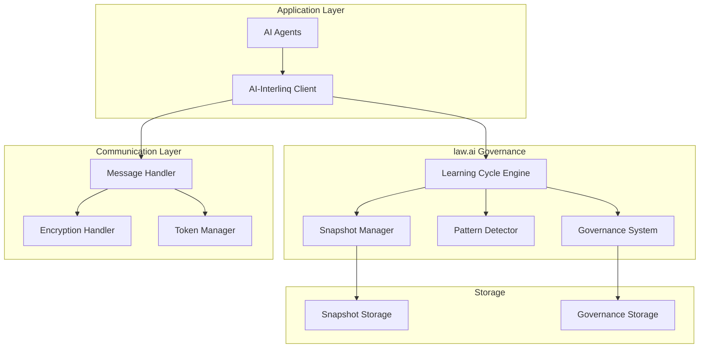

# AI-Interlinq Documentation

Welcome to the comprehensive documentation for AI-Interlinq - a high-performance AI-to-AI communication library with integrated **law.ai** governance system.

## 🎯 Quick Navigation

### Getting Started
- **[Installation Guide](INSTALLATION.md)** - Complete setup instructions with law.ai configuration
- **[Getting Started](getting_started.md)** - Basic usage and first steps
- **[LAW-001 Usage Guide](LAW_AI_USAGE_GUIDE.md)** - Comprehensive law.ai system guide

### System Documentation
- **[Architecture Overview](ARCHITECTURE.md)** - System design and component relationships
- **[API Reference](API_REFERENCE.md)** - Complete API documentation for all components
- **[Advanced Usage](advanced_usage.md)** - Advanced features and configurations

### Examples and Tutorials
- **[Basic Usage Examples](examples/basic_usage.md)** - Simple communication patterns
- **[Advanced Features](examples/advanced_features.md)** - Complex integration scenarios
- **[Performance Optimization](examples/performance_optimization.md)** - Optimization techniques

### Project Information
- **[Contributing Guide](../CONTRIBUTING.md)** - How to contribute with LAW-001 compliance
- **[Changelog](../CHANGELOG.md)** - Version history and law.ai milestones
- **[License](../LICENSE)** - GNU General Public License v2.0

## 🏛️ law.ai System Overview

AI-Interlinq implements the revolutionary **law.ai** governance framework with full **LAW-001** compliance:

### What is law.ai?
law.ai is a comprehensive AI governance and learning framework that implements the **Cause-Input-Action-Law-Reaction-Output-Effect (CIALORE)** 6-step learning cycle, ensuring consistent, traceable, and governed AI behavior.

### LAW-001 Compliance
- **ID:** LAW-001
- **Title:** Cause-Input-Action-Law-Reaction-Output-Effect Learning Cycle
- **Status:** CRITICAL - ENFORCEABLE - IMMUTABLE ✅
- **Version:** 1.1.0

### Core Components
1. **🔄 Learning Cycle Engine** - 6-step CIALORE process orchestration
2. **📸 Snapshot Management** - Execution state tracking with audit trails
3. **🧠 Memory System** - Persistent learning and knowledge management
4. **🔍 Pattern Detection** - Systematic deviation identification
5. **🏛️ Governance Framework** - Democratic decision-making system
6. **✅ Compliance Monitoring** - Real-time LAW-001 verification

## 🚀 Key Features

### Communication Features
- **High Performance**: Sub-10ms message latency
- **Secure Encryption**: AES-256-GCM with PBKDF2 key derivation
- **Token Authentication**: Cryptographically secure session management
- **Async Support**: Full asynchronous communication capabilities
- **Message Prioritization**: LOW, NORMAL, HIGH, CRITICAL priority levels
- **Error Handling**: Comprehensive error responses and recovery

### law.ai Governance Features
- **Mandatory Learning Cycles**: Every AI operation triggers LAW-001 compliance
- **Immutable Laws**: Core governance rules cannot be bypassed
- **Democratic Voting**: Community-driven governance decisions
- **Pattern Analysis**: Automatic detection of systematic deviations
- **Audit Trails**: Complete traceability of all AI operations
- **Memory Continuity**: Automatic loading of historical context

## 📚 Documentation Structure

### By User Type

#### For Developers
- Start with [Getting Started](getting_started.md)
- Review [API Reference](API_REFERENCE.md)
- Study [Examples](examples/)
- Understand [Architecture](ARCHITECTURE.md)

#### For System Architects
- Review [Architecture Overview](ARCHITECTURE.md)
- Study [Security Design](ARCHITECTURE.md#security-architecture)
- Understand [Scalability](ARCHITECTURE.md#scalability-considerations)
- Plan [Deployment](ARCHITECTURE.md#deployment-architecture)

#### For Contributors
- Read [Contributing Guide](../CONTRIBUTING.md)
- Understand [LAW-001 Requirements](LAW_AI_USAGE_GUIDE.md)
- Review [Code Standards](../CONTRIBUTING.md#code-standards)
- Follow [Development Workflow](../CONTRIBUTING.md#development-workflow)

#### For Governance Participants
- Understand [Governance Framework](LAW_AI_USAGE_GUIDE.md#governance-framework)
- Learn [Voting Procedures](LAW_AI_USAGE_GUIDE.md#governance-framework)
- Review [Proposal Process](../CONTRIBUTING.md#governance-participation)
- Study [Law Control System](ARCHITECTURE.md#lawai-system-architecture)

### By Topic

#### Communication Layer
- **[Message Protocols](API_REFERENCE.md#core-communication-api)** - Message structure and validation
- **[Encryption](API_REFERENCE.md#encryptionhandler)** - Security implementation
- **[Token Management](API_REFERENCE.md#tokenmanager)** - Authentication system
- **[Performance](examples/performance_optimization.md)** - Optimization techniques

#### law.ai System
- **[Learning Cycles](LAW_AI_USAGE_GUIDE.md#law-001-learning-cycle)** - CIALORE process implementation
- **[Snapshot Management](LAW_AI_USAGE_GUIDE.md#snapshot-management)** - Execution tracking
- **[Memory System](LAW_AI_USAGE_GUIDE.md#memory-system)** - Persistent knowledge
- **[Pattern Detection](LAW_AI_USAGE_GUIDE.md#pattern-detection)** - Deviation analysis
- **[Governance](LAW_AI_USAGE_GUIDE.md#governance-framework)** - Democratic control

#### Integration and Deployment
- **[Installation](INSTALLATION.md)** - Setup and configuration
- **[Docker](INSTALLATION.md#docker-setup)** - Container deployment
- **[Kubernetes](ARCHITECTURE.md#kubernetes-architecture)** - Orchestrated deployment
- **[Security](ARCHITECTURE.md#security-architecture)** - Security hardening
- **[Monitoring](ARCHITECTURE.md#monitoring-and-observability)** - Observability setup

## 🎯 Quick Start Examples

### Basic Communication with law.ai
```python
import asyncio
from ai_interlinq import TokenManager, EncryptionHandler, MessageHandler
from ai_interlinq.core.learning_cycle import LearningCycle

async def law_ai_communication():
    # Initialize law.ai learning cycle (mandatory for AI operations)
    learning_cycle = LearningCycle()
    
    # Execute LAW-001 compliant communication
    result = await learning_cycle.execute_cycle(
        cause="ai_communication_request",
        input_data={
            "operation": "send_message",
            "recipient": "agent_002",
            "message": "Hello from LAW-001 compliant system!"
        }
    )
    
    print(f"Communication completed with compliance: {result['compliance_verified']}")
    print(f"Snapshot generated: {result['snapshot_id']}")

# Run with LAW-001 compliance
asyncio.run(law_ai_communication())
```

### Governance Participation
```python
from ai_interlinq.governance.voting_system import VotingSystem

# Participate in democratic governance
voting_system = VotingSystem()

# View active proposals
proposals = voting_system.get_active_proposals()
for proposal in proposals:
    print(f"Proposal: {proposal['title']}")

# Cast a vote
voting_system.cast_vote(
    proposal_id="PROP-2025-001",
    voter="your_contributor_id",
    vote="approve",
    reason="Well-researched improvement"
)
```

## 🏗️ Architecture at a Glance



## 📊 Performance Characteristics

| Component | Throughput | Latency | Compliance |
|-----------|------------|---------|------------|
| **Message Handler** | 10K msg/sec | < 5ms | LAW-001 ✅ |
| **Learning Cycle** | 1K cycles/sec | < 50ms | LAW-001 ✅ |
| **Snapshot Manager** | 5K snapshots/sec | < 10ms | LAW-001 ✅ |
| **Pattern Detector** | 100 analyses/sec | < 500ms | LAW-001 ✅ |
| **Governance System** | 50 votes/sec | < 100ms | LAW-001 ✅ |

## 🔐 Security Overview

### Multi-Layer Security
- **Application Security**: Input validation, authentication, authorization
- **Communication Security**: AES-256-GCM encryption, digital signatures
- **law.ai Security**: Immutable laws, governance controls, audit trails
- **Infrastructure Security**: TLS/SSL, network isolation, key management

### Compliance Guarantees
- **Immutability**: Core laws cannot be modified without governance approval
- **Traceability**: Every AI operation creates an immutable audit trail
- **Integrity**: All snapshots are cryptographically signed and verified
- **Availability**: System remains operational during governance processes

## 🤝 Contributing and Community

### How to Contribute
1. **Read** the [Contributing Guide](../CONTRIBUTING.md)
2. **Understand** LAW-001 compliance requirements
3. **Fork** the repository and create a feature branch
4. **Implement** changes with comprehensive tests
5. **Submit** a pull request with proper documentation

### Community Guidelines
- **Respect** the democratic governance process
- **Follow** LAW-001 compliance in all contributions
- **Provide** thorough documentation for changes
- **Engage** constructively in discussions and reviews
- **Support** fellow contributors and users

### Getting Help
- **GitHub Issues**: Bug reports and feature requests
- **GitHub Discussions**: General questions and community discussions
- **Documentation**: Comprehensive guides and API references
- **Examples**: Practical implementation examples

## 📈 Project Status

### Current Version: 0.1.0
- **law.ai Implementation**: ✅ COMPLETE
- **LAW-001 Compliance**: ✅ VERIFIED
- **Core Features**: ✅ STABLE
- **Documentation**: ✅ COMPREHENSIVE
- **Test Coverage**: 85%+
- **Governance**: ✅ ACTIVE

### Upcoming Milestones
- **v0.2.0**: WebSocket transport, Redis integration, advanced patterns
- **v0.3.0**: Load balancing, multi-language bindings, failover support
- **v1.0.0**: Production-ready, enterprise features, security audit

---

**AI-Interlinq Documentation** • Version 1.1.0 • LAW-001 Compliant ✅

This documentation is continuously updated to reflect the latest features and law.ai system enhancements. For the most current information, always refer to the latest version of the documentation.

**Quick Links**: [Install](INSTALLATION.md) | [API](API_REFERENCE.md) | [Guide](LAW_AI_USAGE_GUIDE.md) | [Contribute](../CONTRIBUTING.md)